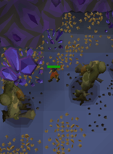

# Prayer Flicking Script



## Overview

The Prayer Flicking Script is an advanced Old School RuneScape (OSRS) script designed to automatically flick protection prayers based on the attack speed of enemies. By toggling the prayer only when it's needed, this script maximizes prayer efficiency and prevents unnecessary prayer point drain, particularly for melee protection prayers.

## Features

- **Automatic Prayer Flicking:** The script intelligently detects the attack speed of enemies and flicks the melee protection prayer accordingly to minimize prayer point usage.
- **Dynamic Enemy Detection:** Automatically detects the enemy the player is currently interacting with and adjusts the prayer flicking behavior based on the specific enemy's attack speed.
- **Modular Design:** The script is structured into modular classes, allowing easy customization and extension for various enemies and attack speeds.
- **Optimized Prayer Usage:** Ensures protection prayers are only active during critical moments, optimizing prayer point conservation.
- **Event-Driven Synchronization:** Leverages game tick and hitsplat events to accurately synchronize prayer flicking with enemy attacks.

## How It Works

The script is composed of several modular classes that work together to provide efficient and responsive prayer flicking:

- **`PrayerFlickingScript`:** The main class responsible for initializing the script, managing the overall flow, and registering the necessary event listeners.
  
- **`EnemyTracker`:** Tracks and manages the enemy that the player is currently interacting with. It handles enemy detection, synchronization, and updates the enemy's attack speed as needed.
  
- **`PrayerFlicker`:** Handles the toggling of the protection prayer based on the synchronized attack timings. It ensures that the prayer is flicked on and off at the precise moments to protect the player.
  
- **`HitSplatListenerImpl`:** A listener class that detects hitsplats on the player. It checks if the prayer is correctly timed and triggers a re-synchronization if a hitsplat occurs without the prayer being active.
  
- **`GameTickListenerImpl`:** A listener class that monitors game ticks, ensuring that the prayer flicking is synchronized with the enemy's attack cycle.

- **`EnemyAttackSpeed`:** An enum that defines various attack speeds (`FAST`, `MEDIUM`, `SLOW`, `VERY_SLOW`) and their corresponding tick values.

- **`EnemyAttackSpeedMapping`:** A utility class that maps enemy names to their respective attack speeds, allowing for easy customization and extension of the script to handle different enemies.

## Script Flow

### Initialization

- The script begins by detecting the enemy the player is interacting with and determining its attack speed using the `EnemyAttackSpeedMapping` class.
- Event listeners (`HitSplatListenerImpl` and `GameTickListenerImpl`) are registered to handle synchronization and prayer flicking.

### Main Loop (`onLoop`)

- The script continuously checks if the player has switched to a different enemy and updates the prayer flicking accordingly.
- It manages the prayer flicking logic based on real-time events such as game ticks and hitsplats.

### Tick Synchronization (`onGameTick`)

- The script listens for game ticks to synchronize prayer flicking with the enemy's attack cycle, ensuring the prayer is toggled at the optimal time.

### Hitsplat Detection (`onHitSplatAdded`)

- The script detects hitsplats on the player and checks if the prayer was correctly active. If a hitsplat occurs without the prayer, it triggers a re-synchronization to correct the timing.

## Configuration

### Enemy Attack Speed Mapping

The `EnemyAttackSpeedMapping` class allows you to easily map enemy names to predefined attack speeds. This makes it simple to extend the script to handle new enemies by adding them to the mapping.

#### Example Mapping:

```java
public class EnemyAttackSpeedMapping {

    public static EnemyAttackSpeed getAttackSpeedForEnemy(String enemyName) {
        switch (enemyName.toLowerCase()) {
            case "moss giant":
                return EnemyAttackSpeed.SLOW;
            case "green dragon":
                return EnemyAttackSpeed.MEDIUM;
            case "guard":
                return EnemyAttackSpeed.SLOW;
            case "goblin":
                return EnemyAttackSpeed.MEDIUM;
            default:
                return EnemyAttackSpeed.MEDIUM;
        }
    }
}
